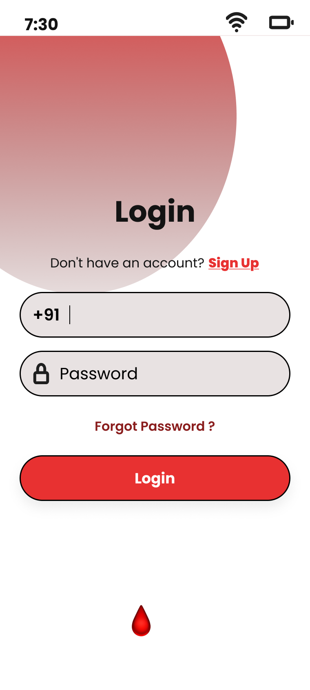
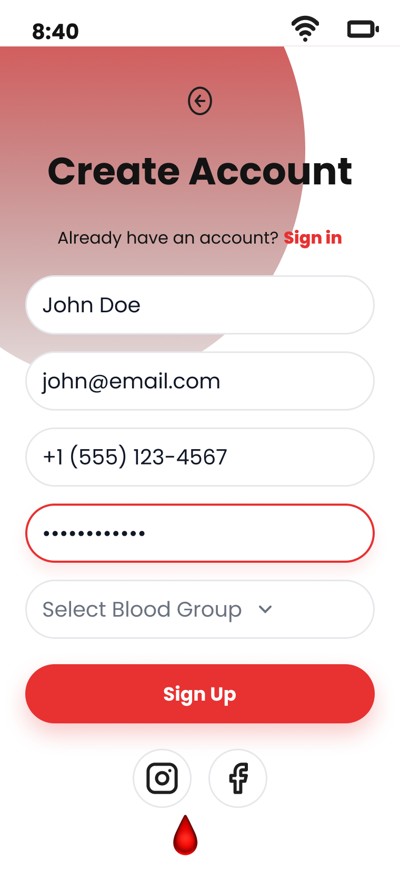
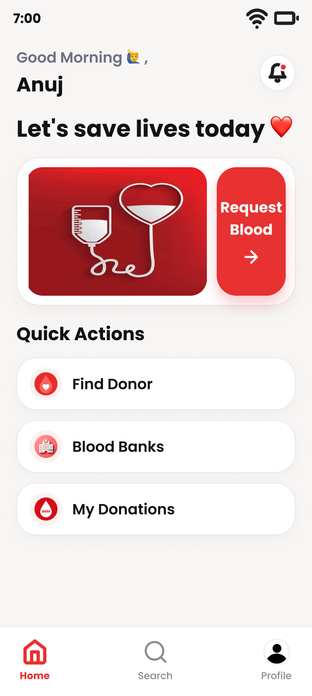
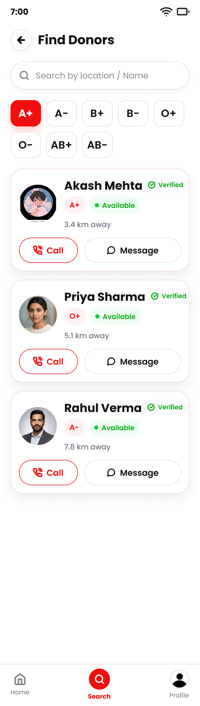
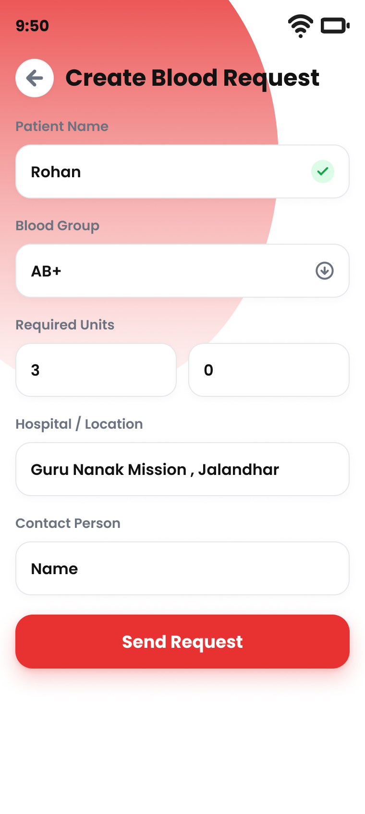
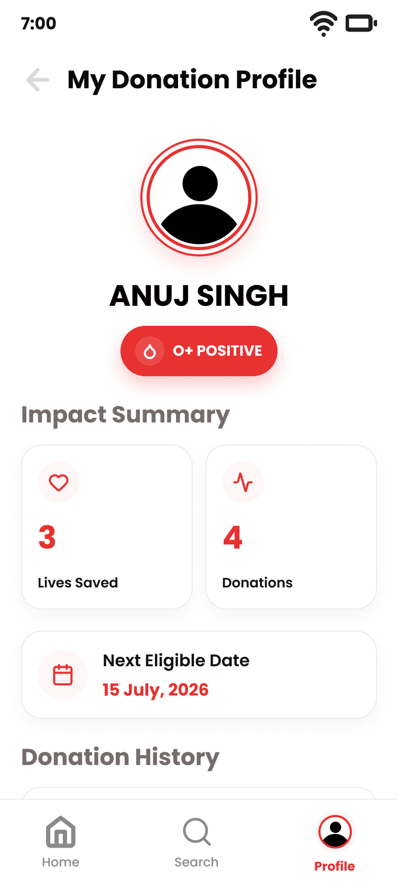

# PulseLink – Blood Donation & Emergency Network

A mobile UI/UX concept designed to simplify blood donor discovery and emergency blood requests through a simple, accessible and user-centered experience.

## 📌 Project Overview

**PulseLink** is a healthcare-focused UI/UX project that aims to make it easier for users to find suitable blood donors, create emergency blood requests, locate blood banks and manage their donation profile.

The project follows a **Human-Centered Design (HCD)** approach, starting from user research and problem definition and progressing through ideation, information architecture, wireframing, high-fidelity UI design and interactive prototyping.

## 🎯 Problem

During blood emergencies, people may face difficulty finding a suitable donor quickly. Existing methods can involve multiple sources and unnecessary steps, creating delays and stress.

PulseLink focuses on creating a simpler and more organized experience for donor discovery and blood requests.

## 💡 Solution

PulseLink provides a simple mobile experience with:

* 🔎 Donor search and blood-group filtering
* 🩸 Emergency blood request
* 📍 Blood bank discovery
* 👤 Donation profile
* ✅ Verified donor information concept
* 📞 Quick donor communication
* 📱 Simple emergency-focused navigation

## 🔬 Design Process

The project follows the Human-Centered Design process:

### 1. Discover

* Background research
* User research
* Google Form survey
* Competitor analysis
* Secondary research

### 2. Define

* Research insights
* Affinity mapping
* User persona
* Empathy map
* User journey map
* Problem statement
* How Might We questions

### 3. Ideate

* Brainstorming
* Crazy 8 / concept exploration
* Feature exploration
* User flow
* Information architecture

### 4. Design

* Low-fidelity wireframes
* High-fidelity UI
* Design system
* Components
* Visual style guide

### 5. Prototype & Test

* Interactive Figma prototype
* Prototype interaction flow
* Usability evaluation / planned testing
* Design improvement opportunities

## 📊 User Research

A Google Form survey was conducted to understand users' blood donation experience and willingness to donate.

**Survey responses:** 20

Key response distribution:

* Yes, multiple times — 10%
* Yes, once — 20%
* No, but I would like to — 40%
* Never — 30%

These findings helped inform the need for an easier and more accessible blood donation and donor-discovery experience.

## 🎨 Design

The interface uses a red and white healthcare-oriented visual identity.

### Design characteristics

* Clean and minimal interface
* Consistent typography
* Rounded cards and components
* Clear call-to-action buttons
* Emergency-focused navigation
* Simple information hierarchy

## 📱 Screens

### Splash Screen

### Login

### Sign Up

### Home

### Find Donor

### Blood Request

### Donation Profile

## 🛠️ Tools

* Figma
* Google Forms
* PowerPoint

## 🚀 Future Scope

The concept can be extended with:

* Real-time donor matching
* GPS-based nearby donor discovery
* Blood bank inventory integration
* Push notifications
* Multilingual support
* Secure authentication
* Backend/database integration
* Integration with healthcare and blood-bank systems

## 📌 Project Status

**Completed:** UI/UX design and high-fidelity interactive prototype.

The current project is a Figma-based UI/UX prototype. Real-time authentication, database connectivity and live donor search would be implemented during the development phase.

## 👨‍💻 Project

** Pulse Link – Blood Donation & Emergency Network **

UI/UX Design Project
